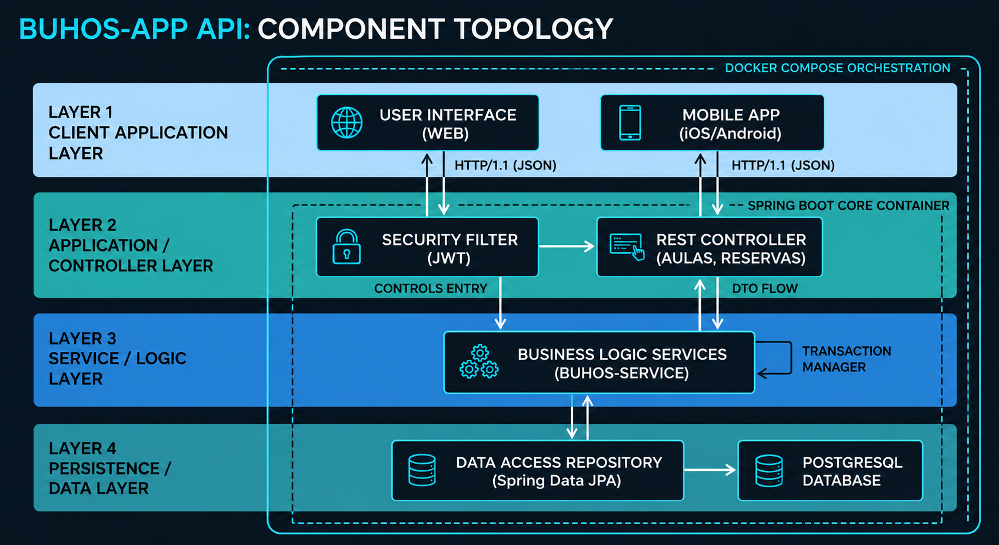

# Diseño Arquitectónico e Infraestructura

El núcleo backend de **Buhos-App** adopta una arquitectura en capas lógicas (**N-Capas**). Esta separación de responsabilidades asegura que las reglas de negocio permanezcan completamente agnósticas a las tecnologías de transporte (controladores REST) o de persistencia física (ORM / Postgres).

## Flujo de Información de una Solicitud

Cuando una petición HTTP golpea el servidor, atraviesa una serie de transformaciones y validaciones internas antes de persistirse o devolver un resultado:

### Ciclo del Ciclo de Vida del Dato:
1. **Controlador (REST Controller):** Captura el payload y valida las restricciones sintácticas básicas.
2. **Capa de Servicios (Service Layer):** Ejecuta las validaciones transaccionales y aplica la lógica empresarial central.
3. **Persistencia (Repository/DAO):** Coordina los accesos e interacciones con el motor de base de datos a través de sentencias eficientes.

!!! tip "Gestión de Datos Limpios (DTOs)"
    Para no acoplar la base de datos con los clientes externos, se recomienda mapear siempre las entidades JPA a objetos de transferencia de datos independientes (**DTOs**) en la capa del controlador.

## Aislamiento con Entornos Docker

El ecosistema se distribuye empaquetado en contenedores individuales coordinados mediante `docker-compose.yml`. Esto mitiga por completo el clásico conflicto de "en mi máquina sí funciona", aislando el contenedor de la aplicación Java del contenedor de persistencia en PostgreSQL.